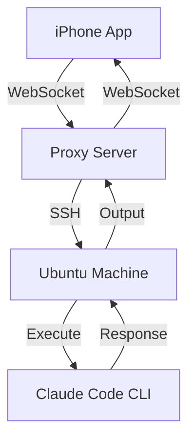

# Ananya - SSH Terminal for iOS 🚀

> **Transform your iPhone into a powerful SSH terminal with voice control for seamless interaction with Claude Code CLI**

[](https://reactnative.dev/)
[](https://expo.dev/)
[](LICENSE)
[](https://www.apple.com/ios/)
[](https://www.typescriptlang.org/)

Ananya is a revolutionary iOS application that bridges the gap between mobile convenience and terminal power. Connect securely to your Ubuntu machines and interact with Claude Code CLI using natural voice commands or traditional keyboard input - all from your iPhone.

## ✨ Key Features

### Core Functionality
- **🔐 Secure SSH Connections** - Enterprise-grade security with encrypted credential storage
- **🎤 Voice Command Input** - Natural language processing for hands-free terminal control
- **💾 Credential Manager** - Secure storage using iOS Keychain with biometric protection
- **📱 Native iOS Experience** - Optimized for iPhone with full iOS 14+ integration
- **⌨️ Terminal Emulation** - Full ANSI terminal with color support and command history
- **🔊 Speech Recognition** - Advanced voice-to-text transcription for terminal commands

### Advanced Features
- **🌐 WebSocket Proxy Architecture** - Bypass iOS restrictions while maintaining security
- **🔄 Auto-reconnection** - Intelligent connection management with automatic recovery
- **📊 Session Management** - Multiple saved connections with quick switching
- **🎨 Customizable Themes** - Dark/light modes with terminal color schemes
- **⚡ Performance Optimized** - Minimal battery usage with efficient networking
- **🔒 Privacy First** - All data processed locally, no telemetry

## 🏗️ Architecture



### Components

1. **iOS App (React Native/Expo)**
   - User Interface Layer
   - Voice Processing Engine
   - Secure Storage Manager
   - WebSocket Client

2. **Proxy Server (Node.js)**
   - WebSocket Server
   - SSH Client Manager
   - Connection Pool
   - Security Layer

## 🚀 Quick Start

### Prerequisites

- ✅ Node.js 18+ and npm
- ✅ Expo CLI: `npm install -g expo-cli`
- ✅ EAS CLI: `npm install -g eas-cli`
- ✅ Apple Developer Account ($99/year for App Store)
- ✅ Xcode 14+ (macOS only for iOS builds)

### 1. Install Dependencies

```bash
# Install app dependencies
cd ananya
npm install

# Install proxy server dependencies
cd proxy-server
npm install
```

### 2. Configure the Proxy Server

The proxy server is required because iOS doesn't allow direct SSH connections from apps.

```bash
cd proxy-server
cp .env.example .env
# Edit .env with your configuration
```

Deploy the proxy server to a cloud provider (e.g., Heroku, AWS, DigitalOcean):

```bash
# Example for deployment (adjust based on your provider)
npm start
```

### 3. Update App Configuration

Edit `src/components/SSHConnection.tsx` and update the WebSocket URL to point to your deployed proxy server:

```javascript
const ws = new WebSocket(`wss://your-proxy-server.com/ssh`);
```

### 4. Configure iOS Build

Update `app.json`:
- Change `bundleIdentifier` to your unique identifier
- Update icon and splash screen in `assets/` folder

Update `eas.json`:
- Add your Apple ID and team information
- Configure your EAS project ID

### 5. Build for iOS

```bash
# Login to Expo/EAS
eas login

# Configure your project
eas build:configure

# Build for iOS
eas build --platform ios
```

### 6. Submit to App Store

```bash
# Submit to App Store Connect
eas submit --platform ios
```

## Local Development

### Run the app locally:

```bash
# Start the development server
npx expo start

# Run on iOS Simulator
npx expo run:ios

# Or scan QR code with Expo Go app on your iPhone
```

### Run the proxy server locally:

```bash
cd proxy-server
npm run dev
```

## Usage

1. **Launch the app** on your iPhone
2. **Enter SSH credentials**:
   - Host: Your Ubuntu machine's IP address
   - Port: 22 (default SSH port)
   - Username: Your Ubuntu username
   - Password: Your password
3. **Connect** to establish SSH session
4. **Use voice or keyboard** to enter commands
5. **Interact with Claude Code CLI** as if you were at your Ubuntu terminal

## Voice Commands

Press and hold the microphone button to record a command. The app will transcribe your speech and send it to the terminal.

## Security Considerations

- Credentials are stored securely using iOS Keychain (via expo-secure-store)
- WebSocket connections should use WSS (secure WebSocket) in production
- Consider implementing additional authentication for the proxy server
- Never commit sensitive information to the repository

## App Store Guidelines Compliance

This app complies with Apple's App Store guidelines:
- Uses secure connections (WSS/HTTPS)
- Implements proper permission requests for microphone
- No private API usage
- Follows iOS Human Interface Guidelines

## Troubleshooting

### Connection Issues
- Verify your proxy server is running and accessible
- Check firewall settings on your Ubuntu machine
- Ensure SSH is enabled on your Ubuntu machine

### Voice Recognition
- Grant microphone permissions when prompted
- Speak clearly and close to the device
- Check internet connection (required for speech-to-text)

## Future Enhancements

- [ ] Add biometric authentication (Face ID/Touch ID)
- [ ] Implement SSH key authentication
- [ ] Add support for multiple saved connections
- [ ] Integrate native iOS Speech Recognition framework
- [ ] Add terminal color themes
- [ ] Implement gesture controls
- [ ] Add file transfer capabilities

## 🤝 Contributing

We welcome contributions! Please see our [Contributing Guidelines](CONTRIBUTING.md) for details.

1. Fork the repository
2. Create your feature branch (`git checkout -b feature/AmazingFeature`)
3. Commit your changes (`git commit -m 'Add some AmazingFeature'`)
4. Push to the branch (`git push origin feature/AmazingFeature`)
5. Open a Pull Request

### Development Setup

```bash
# Clone the repo
git clone https://github.com/iodev/ananya.git
cd ananya

# Install dependencies
npm install
cd proxy-server && npm install

# Start development
npm start  # In app directory
npm run dev  # In proxy-server directory
```

## 📄 License

This project is licensed under the MIT License - see the [LICENSE](LICENSE) file for details.

## 🆘 Support

- **Issues**: [GitHub Issues](https://github.com/iodev/ananya/issues)
- **Discussions**: [GitHub Discussions](https://github.com/iodev/ananya/discussions)
- **Documentation**: [Wiki](https://github.com/iodev/ananya/wiki)

## 🙏 Acknowledgments

- [React Native](https://reactnative.dev/) - Mobile framework
- [Expo](https://expo.dev/) - Development platform
- [ssh2](https://github.com/mscdex/ssh2) - SSH client implementation
- [Claude Code CLI](https://claude.ai/code) - AI-powered development assistant
- [expo-av](https://docs.expo.dev/versions/latest/sdk/av/) - Audio/Video capabilities

## 📊 Stats


---

**Made with ❤️ for developers who need SSH on the go**

*Connect. Command. Conquer. - All from your iPhone.*